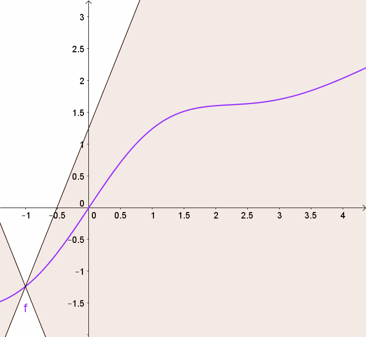

# Chapter 4 ~ 5 supplementary

## 利普希茨连续 (Lipschitz continuous)

在优化问题中，Lipschitz 连续性通常用来描述函数的梯度变化是否平滑。如果损失函数的梯度是 Lipschitz 连续的，则可以保证优化算法的稳定性和收敛性。

- **扰动敏感**

记输入为 $x$，输出为 $y$，模型为 $f$，模型参数为 $w$，记为

\[ y = f_w(x) \] 

很多时候，我们希望得到一个“robust”的模型。稳健的含义一般来说有两种含义，一是对于参数扰动的稳定性，比如模型变成了 $f_{w+\Delta w}(x)$ 后是否还能达到相近的效果？如果在动力学系统中，还要考虑模型最终是否能恢复到 $f_w(x)$；二是对于输入扰动的稳定性，比如输入从 $x$ 变成了 $x + \Delta x$ 后，$f_w(x + \Delta x)$ 是否能给出相近的预测结果。For example，图片只改变一个像素就给出完全不一样的分类结果，这就是模型对输入过于敏感的案例。

- **L 约束**

所以，大多数时候我们都希望模型对输入扰动是不敏感的，这通常能提高模型的泛化性能。也就是说，我们希望 $\|x_1-x_2\|$ 很小时，$\|f_w(x_1) - f_w(x_2)\|$ 也尽可能小。

于是 Lipschitz 提出了一个更具体的约束，那就是存在某个常数 $ C $（它只与参数有关，与输入无关），使得下式恒成立

\[  
\|f_w(x_1) - f_w(x_2)\| \leqslant C(w) \cdot \|x_1 - x_2\| \]

也就是说，希望整个模型被一个线性函数“控制”住。这便是L约束了。

在花书中，认为满足L约束的模型才是一个好模型，并且对于具体的模型，我们希望估算出 $C(w)$ 的表达式，并且希望 $C(w)$ 越小越好，越小意味着它对输入扰动越不敏感，泛化性越好。

- **Lipschitz 连续性**

梯度下降法在选择学习率时，可使用 Lipschitz 常数 L 作为学习率的上界，确保算法稳定。在分析优化算法的收敛速度时，Lipschitz 条件可以简化复杂性证明。

**几何意义：** Lipschitz 连续性要求输出变化的速率始终被一个常数 L 全局限制。

*对于 Lipschitz 连续函数，存在一个双锥（白色），其原点可以沿图形移动，以便整个图形始终保持在双锥体外。*

##  数字码
*`分类任务中有一类是对象识别，输入是图片(通常用一组像素亮度值表示)，输出是表示图片物体的数字码。`*

在这段文字中，提到的“数字码”是指在分类任务中，模型输出的一个数值，这个数值用来代表输入数据所属的类别。这里的“数字码”是一个抽象的概念，用于标识不同的类别。在机器学习中，尤其是在分类问题中，模型会根据输入数据的特征，将其映射到一个预定义的类别上。

例如，在对象识别任务中，如果一个模型被训练来识别猫、狗和鸟，那么它可能会将输入的图片映射到三个类别中的一个，分别用数字码1、2、3来表示。

在更复杂的分类问题中，模型可能会输出一个概率分布，而不是单一的数字码。这个概率分布表示输入数据属于每个类别的可能性。例如，对于同一个图片，模型可能会输出一个概率分布，如[0.1, 0.7, 0.2]，这表示模型认为图片是猫的概率是10%，是狗的概率是70%，是鸟的概率是20%。

## 半监督学习 (semi-supervised learning)

半监督学习（Semi-Supervised Learning, SSL）是一种机器学习范式，它结合了**少量**带标签数据（labeled data）和**大量**无标签数据（unlabeled data），旨在利用无标签数据提升模型性能。由于标注数据获取成本高，而无标签数据往往丰富且廉价，因此半监督学习在许多实际问题中应用更加广泛。

**1. 半监督学习的核心思想**

半监督学习的基本假设有以下几个：

- 平滑性假设（Smoothness Assumption）: 相近的点有类似的标签。
- 聚类假设（Cluster Assumption）: 数据点聚类分布，聚类内部的点有相同的标签。
- 低维流形假设（Manifold Assumption）: 数据分布在一个低维流形上，相邻点的标签应该一致。

这些假设使得无标签数据能够为模型提供有效的结构信息，从而改进分类或回归任务的表现。

**2. 半监督学习的主要方法**

以下是半监督学习的常见技术：

(1) 基于生成模型

- 假设数据由一个生成过程产生，并对该过程建模。
- 例如，使用贝叶斯网络、隐马尔可夫模型（HMM）或变分自编码器（VAE）来建模带标签和无标签数据。

(2) 自训练（Self-training）

- 通过初始模型预测无标签数据的伪标签（pseudo-label），将高置信度的伪标签数据加入训练集。
- 模型不断更新，迭代改进伪标签质量。

(3) 一致性正则化（Consistency Regularization）

- 利用无标签数据时，假设模型对相同输入的不同扰动应该产生一致的输出。
- 典型方法：Mean Teacher、Pi Model。

(4) 图形半监督学习（Graph-Based SSL）

- 将数据建模为图，其中节点代表样本，边的权重表示样本之间的相似度。
- 标签通过图传播（Label Propagation）来扩展到无标签数据。

(5) 对抗性训练（Adversarial Training）

- 使用对抗生成方法，通过生成器生成伪标签样本，判别器区分真实标签和伪标签，改进模型性能。
- 应用实例：Semi-Supervised GAN (SGAN)。

**3. 实例与应用场景**

实例 1: 文本分类

在自然语言处理（NLP）中，标签数据的获取成本很高，例如新闻分类、情感分析等任务：

- 方法: 结合少量带标签新闻文本和大量无标签文本。
- 示例: 使用一致性正则化方法训练一个分类器，通过对输入文本的不同扰动（如数据增强）保持一致性，从无标签数据中学习更多的语义信息。

实例 2: 图像分类

在图像识别中，标注大量图片成本昂贵，而无标签图片较为容易获取。

- 方法: 利用基于一致性正则化的模型，如 FixMatch、MixMatch。
- 示例: 在 CIFAR-10 数据集上，使用少量标注图片（如每类仅 40 张），结合大量无标签图片训练出接近全监督水平的分类器。

实例 3: 医疗数据分析

医疗影像（如 X 光、MRI）中，标注需要医生参与，成本高。

- 方法: 图形半监督学习。
- 示例: 通过构建样本相似度图，利用带标签样本的信息通过图传播算法扩展到无标签样本。

实例 4: 语音识别

在语音识别任务中，带标签的语音样本标注耗时耗力。

- 方法: 使用变分自编码器 (VAE) 或自监督模型（如 Wav2Vec）。
- 示例: 使用大量无标签语音样本进行特征提取，结合少量标注语音实现高效语音识别。

|方法	|核心特点|应用场景|优势|
| ----- | ------- | ----- | ----- |
|Mean Teacher|教师-学生框架，一致性正则化|图像分类、语音识别|稳定性强，效果好|
|Pi Model|输入扰动，一致性正则化|图像分类|简单易实现|
|FixMatch|强弱增强结合，伪标签筛选|图像分类|简单高效，接近全监督性能|
|MixMatch|伪标签生成 + 数据混合|图像分类|伪标签质量高，正则化效果强|
|Wav2Vec |自监督语音特征学习|语音识别、语音分析|对标签依赖低，适合语音相关任务|

**4.综述文章**

1. An Overview of Deep Semi-Supervised Learning (Yassine Ouali & Céline Hudelot & Myriam Tami, 2020) 
讨论了深度学习如何增强半监督学习的能力，包括通过更复杂的特征提取和表征学习实现更强的模型泛化能力，提供了不同领域的应用实例（如计算机视觉、医学影像分析）。
- [https://doi.org/10.1561/2200000005](https://arxiv.org/pdf/2006.05278)

2. A Survey on Deep Semi-Supervised Learning （Xiangli Yang, 2023）
系统地介绍了早期的半监督学习方法，包括基于生成模型的方法、图方法、一致性正则化等。
- [https://arxiv.org/abs/2103.00550](https://arxiv.org/abs/2103.00550)

