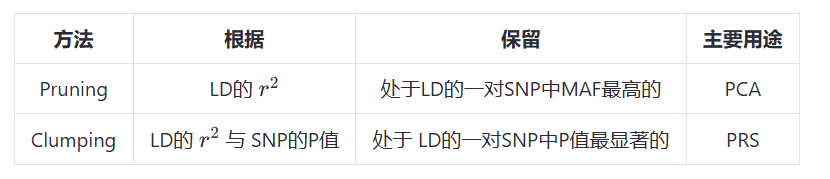

# pruning and clumping

在基因组关联研究中，"pruning" 和 "clumping" 是两种用于处理和解释关联信号的方法，它们都涉及到去除冗余或无关紧要的信息，但侧重点和应用有所不同。

## Pruning（修剪）

- **定义**:
  - Pruning 是指从一组 SNP 中去除那些与其他 SNP 高度连锁不平衡（LD, linkage disequilibrium）的 SNP 。这意味着如果两个或多个 SNP 彼此之间存在很强的**相关性**，则仅保留其中一个代表性的SNP，其余的会被**剔除**。
  
- **目的**:
  - 减少冗余信息，提高计算效率。
  - 在构建遗传风险评分（GRS, Genetic Risk Scores）时，pruning 可以帮助选择一组独立的 SNP ，以避免过拟合和提高预测性能。

- **应用场景**:
  - 选取第一个 SNP ，然后计算这个 SNP 与窗口区间里第二个，第三个，等等的 $r^2$ ，当检测到高的相关性时，就会从这一对 SNP 中去除 **MAF 较低**的那个，保留 MAF 高的，也就是说这个过程中可能会去除掉我们选的第一个 SNP。完成后下一步就是选取下一个SNP，重复这个过程
  - 构建GRS时，确保 SNP 之间低相关性，避免多重共线性问题。

## Clumping（聚集）

- **定义**:
  - Clumping 是一种基于关联信号强度和连锁不平衡（LD）结构来聚类 SNP 的方法。它旨在识别那些在基因组区域内可能与同一表型或疾病相关的 SNP 簇。
  
- **目的**:
  - 识别独立的关联信号，即找出那些可能代表相同遗传效应的不同 SNP 群集。
  - 通过对关联结果进行分组，可以更清晰地理解遗传变异的作用机制。

- **应用场景**:
  - 首先会依据从GWAS得到的 $p$ 值对 SNP 的重要性进行排序，然后选取排序后的第一个 SNP ，计算这个 SNP 与窗口区间里其他 SNP 的 $r^2$ ，当检测到高的相关性时，就会从这一对 SNP 中去除重要性低的那个，这个过程中我们选的**第一个 SNP 一定会得到保留**。完成后下一步就是选取p值排序后的下一个 SNP ，重复这个过程。
  - 当研究者希望从众多显著 SNP 中确定关键的因果变异时,clumping 是一种有用的技术。

### 比较

- **Pruning vs Clumping**:
  - **Pruning** 更多地是关于去除冗余 SNP ，以得到一组相互独立的 SNP ，通常用于减少多重比较带来的问题，提高统计模型的解释力。
  - **Clumping** 则是将 SNP 按照其连锁不平衡程度和关联强度进行分组，从而识别出可能的独立遗传效应区域。

### 总结

- **Pruning** 主要用于减少冗余，选择独立的 SNP ，适用于构建GRS或其他需要独立 SNP 的情况。
- **Clumping** 则是为了识别独立的遗传效应信号，帮助研究者从GWAS结果中分离出真正的关联信号。

***
 

在PLINK中提供了 Pruning 和 Clumping 的功能，可以参考plink的命令解释与相关文档

Refer to：

https://www.cog-genomics.org/plink/1.9/postproc
https://www.biostars.org/p/343818/